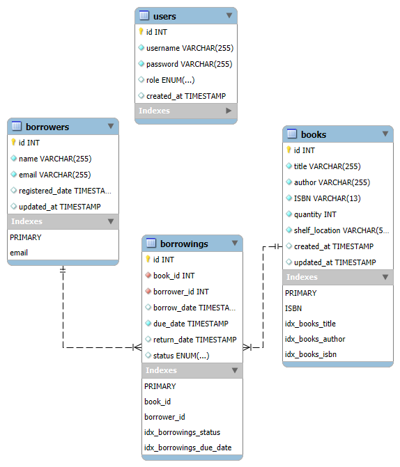

# Library Management System

A comprehensive Library Management System built with Node.js and MySQL. Manage books, borrowers, and track borrowing processes efficiently.

## Table of Contents
- [Features](#features)
- [Getting Started](#getting-started)
  - [Prerequisites](#prerequisites)
  - [Method 1: Local Installation](#method-1-local-installation)
  - [Method 2: Docker Setup](#method-2-docker-setup)
- [API Documentation](#api-documentation)
- [Database Schema](#database-schema)
- [Testing](#testing)
- [Security Features](#security-features)

## Features

✨ **Core Features**
- Book Management (CRUD operations)
- Borrower Management
- Borrowing Process & Due Date Tracking
- Book Search & Availability Management
- Analytics & Reporting
- Rate Limiting on Critical Endpoints
- Docker Support
- Unit Tests for Book Module
- Export borrowing history to CSV
- Overdue books report generation
- Monthly borrowing statistics

🛡️ **Technical Features**
- JWT & Basic Authentication
- API Documentation with Swagger

## Getting Started

### Prerequisites
- Node.js (v14+)
- MySQL (v8+)
- npm/yarn
- Docker (optional)

### Method 1: Local Installation

1. Clone and install:
   ```bash
   git clone https://github.com/MinaM99/Library-Management-System.git
   cd Library-Management-System
   npm install
   ```

2. Configure environment:
   ```bash
   cp .env.example .env
   ```
   Update `.env` with your configuration:
   ```env
   PORT=3000
   DB_HOST=localhost
   DB_USER=root
   DB_PASSWORD=your_password
   DB_NAME=library_management
   JWT_SECRET=your_jwt_secret
   ```

3. Initialize the database:
   ```bash
   mysql -u root -p < src/config/schema.sql
   mysql -u root -p < src/config/auth_schema.sql
   ```

4. Start the application:
   ```bash
   npm start
   ```

### Method 2: Docker Setup
```bash
docker-compose up --build
```

The application will be available at `http://localhost:3000`

## API Documentation

- Interactive API documentation is available at: `http://localhost:3000/api-docs`
- Full endpoint details, request/response examples, and authentication methods are documented in Swagger UI.
- Supports both Swagger UI and OpenAPI 3.0 specification
- Includes authentication methods:
  - Basic Auth
  - JWT Bearer token
- Documented endpoints for:
  - 🔐 Authentication & User Management
  - 📚 Books API
  - 👥 Borrowers API
  - 📖 Borrowing & Checkout API
  - 📊 Analytics API

## Database Schema



### Tables
- `books`: Stores book information (title, author, ISBN, quantity, location)
- `borrowers`: Manages borrower details (name, email, registration date)
- `borrowings`: Tracks borrowing records (book, borrower, dates, status)
- `users`: Handles user authentication (username, password, role)

## Testing

- Unit tests for Book module using Jest
- Mock database operations
- Run all tests:
  ```bash
  npm test
  ```
- Example test file: `tests/book.test.js`

## Security Features

🔒 **Authentication & Authorization**
- Basic Authentication
- JWT token support
- Password hashing with bcrypt
- Role-based access (admin/user)

🛡️ **Data Protection**
- Input validation
- SQL injection prevention
- XSS protection
- Rate limiting on critical endpoints

📝 **Error Handling**
- Secure error messages
- Request validation
- Proper HTTP status codes
