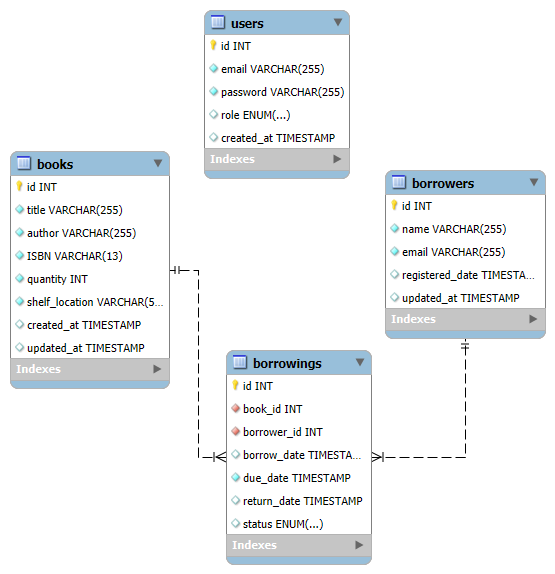

# Library Management System

A comprehensive Library Management System built with Node.js and MySQL. Manage books, borrowers, and track borrowing processes efficiently.

## Table of Contents
- [Features](#features)
- [Getting Started](#getting-started)
  - [Prerequisites](#prerequisites)
  - [Method 1: Local Installation](#method-1-local-installation)
  - [Method 2: Docker Setup](#method-2-docker-setup)
- [API Documentation](#api-documentation)
- [Database Schema](#database-schema)
- [Testing](#testing)
- [Security Features](#security-features)

## Features

✨ **Core Features**
- Book Management (CRUD operations)
- Borrower Management
- Borrowing Process & Due Date Tracking
- Book Search & Availability Management
- Analytics & Reporting
- Rate Limiting on Critical Endpoints
- Docker Support
- Unit Tests for Book Module
- Export borrowing history to CSV
- Overdue books report generation
- Monthly borrowing statistics

🛡️ **Technical Features**
- JWT & Basic Authentication
- API Documentation with Swagger

## Getting Started

### Prerequisites
- Node.js (v14+)
- MySQL (v8+)
- npm/yarn
- Docker (optional)

### Method 1: Local Installation

1. Clone and install:
   ```bash
   git clone https://github.com/MinaM99/Library-Management-System.git
   cd Library-Management-System/backend
   npm install
   ```

2. Configure environment:
   ```bash
   cp .env.example .env
   ```
   Update `.env` with your configuration:
   ```env
   PORT=3000
   DB_HOST=localhost
   DB_USER=root
   DB_PASSWORD=your_password
   DB_NAME=library_management
   JWT_SECRET=your_jwt_secret
   ```

### Environment Variables Reference

| Variable | Description | Default | Required |
|----------|-------------|---------|----------|
| `PORT` | Server port number | `3000` | ❌ |
| `DB_HOST` | MySQL database host | `localhost` | ✅ |
| `DB_USER` | MySQL username | `root` | ✅ |
| `DB_PASSWORD` | MySQL password | - | ✅ |
| `DB_NAME` | Database name | `library_management` | ✅ |
| `JWT_SECRET` | Secret key for JWT tokens | - | ✅ |
| `NODE_ENV` | Environment mode | `development` | ❌ |

3. Initialize the database:
   ```bash
   mysql -u root -p < src/config/schema.sql
   mysql -u root -p < src/config/auth_schema.sql
   ```

4. Start the application:
   ```bash
   npm start
   ```

### Method 2: Docker Setup

#### Option A: Backend Only
```bash
cd backend
docker-compose up --build
```

#### Option B: Full Stack (Backend + Frontend)
```bash
# From project root directory
docker-compose up --build
```

#### Docker Environment Setup
- Docker automatically sets up the MySQL database
- Environment variables are configured in `docker-compose.yml`
- No manual database initialization required
- Backend will be available at `http://localhost:3000`
- Database will be available at `localhost:3306`

The application will be available at `http://localhost:3000`

## API Documentation

- Interactive API documentation is available at: `http://localhost:3000/api-docs`
- Full endpoint details, request/response examples, and authentication methods are documented in Swagger UI.
- Supports both Swagger UI and OpenAPI 3.0 specification
- Includes authentication methods:
  - Basic Auth
  - JWT Bearer token

### API Endpoints

#### 🔐 Authentication Endpoints
| Method | Endpoint | Description | Auth Required |
|--------|----------|-------------|---------------|
| `POST` | `/api/auth/register` | Register a new user | ❌ |
| `POST` | `/api/auth/login` | Login user and get JWT token | ❌ |
| `GET` | `/api/auth/users` | Get all users | ❌ |
| `DELETE` | `/api/auth/users/:id` | Delete a user | ❌ |

#### 📚 Books Management
| Method | Endpoint | Description | Auth Required |
|--------|----------|-------------|---------------|
| `GET` | `/api/books` | Get all books | ✅ |
| `GET` | `/api/books/search` | Search books by title, author, or ISBN | ✅ |
| `GET` | `/api/books/:id` | Get specific book by ID | ✅ |
| `POST` | `/api/books` | Add a new book | ✅ |
| `PUT` | `/api/books/:id` | Update book information | ✅ |
| `DELETE` | `/api/books/:id` | Delete a book | ✅ |

#### 👥 Borrowers Management
| Method | Endpoint | Description | Auth Required |
|--------|----------|-------------|---------------|
| `GET` | `/api/borrowers` | Get all borrowers | ✅ |
| `GET` | `/api/borrowers/:id` | Get specific borrower by ID | ✅ |
| `GET` | `/api/borrowers/:id/borrowings` | Get current borrowings for a borrower | ✅ |
| `POST` | `/api/borrowers` | Register a new borrower | ✅ |
| `PUT` | `/api/borrowers/:id` | Update borrower information | ✅ |
| `DELETE` | `/api/borrowers/:id` | Delete a borrower | ✅ |

#### 📖 Borrowing & Checkout
| Method | Endpoint | Description | Auth Required |
|--------|----------|-------------|---------------|
| `GET` | `/api/borrowings` | Get all borrowing records | ✅ |
| `GET` | `/api/borrowings/overdue` | Get all overdue books | ✅ |
| `GET` | `/api/borrowings/overdue/borrower/:borrowerId` | Get overdue books for specific borrower | ✅ |
| `GET` | `/api/borrowings/borrower/:id` | Get all borrowed books by borrower | ✅ |
| `POST` | `/api/borrowings/checkout` | Checkout a book to a borrower | ✅ |
| `PUT` | `/api/borrowings/:id/return` | Return a borrowed book | ✅ |

#### 📊 Analytics & Reports
| Method | Endpoint | Description | Auth Required |
|--------|----------|-------------|---------------|
| `GET` | `/api/analytics/export/borrowings` | Export borrowing history for specific period | ✅ |
| `GET` | `/api/analytics/export/overdue` | Export overdue books report | ✅ |
| `GET` | `/api/analytics/export/last-month/borrowings` | Export last month's borrowing statistics | ✅ |
| `GET` | `/api/analytics/export/last-month/overdue` | Export last month's overdue books | ✅ |

#### 📋 Query Parameters

**Books Search (`/api/books/search`)**
- `title` - Search by book title
- `author` - Search by author name
- `isbn` - Search by ISBN

**Analytics Export (`/api/analytics/export/borrowings`)**
- `startDate` - Start date (YYYY-MM-DD format)
- `endDate` - End date (YYYY-MM-DD format)

#### 🔑 Authentication
- **Basic Auth**: Use username/password in Authorization header
- **JWT Bearer Token**: Include `Authorization: Bearer <token>` header
- Get JWT token from `/api/auth/login` endpoint
- All endpoints except authentication require authentication

#### ⚡ Rate Limiting
The following endpoints have rate limiting enabled:
- `/api/auth/register` - User registration
- `/api/auth/login` - User login  
- `/api/books/search` - Book search

#### 📝 Example Usage

**Register a new user:**
```bash
curl -X POST http://localhost:3000/api/auth/register \
  -H "Content-Type: application/json" \
  -d '{"email": "user@example.com", "password": "password123", "role": "admin"}'
```

**Login:**
```bash
curl -X POST http://localhost:3000/api/auth/login \
  -H "Content-Type: application/json" \
  -d '{"email": "user@example.com", "password": "password123"}'
```

**Get all books (with JWT token):**
```bash
curl -X GET http://localhost:3000/api/books \
  -H "Authorization: Bearer YOUR_JWT_TOKEN"
```

**Checkout a book:**
```bash
curl -X POST http://localhost:3000/api/borrowings/checkout \
  -H "Authorization: Bearer YOUR_JWT_TOKEN" \
  -H "Content-Type: application/json" \
  -d '{"book_id": 1, "borrower_id": 1}'
```
#### 📄 Response Examples

**Successful Login Response:**
```json
{
  "message": "Login successful",
  "token": "eyJhbGciOiJIUzI1NiIsInR5cCI6IkpXVCJ9...",
  "user": {
    "id": 1,
    "email": "user@example.com",
    "role": "admin"
  }
}
```

**Book List Response:**
```json
[
  {
    "id": 1,
    "title": "The Great Gatsby",
    "author": "F. Scott Fitzgerald",
    "isbn": "978-0-7432-7356-5",
    "available_quantity": 3,
    "shelf_location": "A-101"
  }
]
```

**Checkout Success Response:**
```json
{
  "message": "Book checked out successfully",
  "borrowing": {
    "id": 15,
    "book_id": 1,
    "borrower_id": 1,
    "borrow_date": "2025-09-10T00:00:00.000Z",
    "due_date": "2025-09-24T00:00:00.000Z",
    "status": "borrowed"
  }
}
```

**Error Response:**
```json
{
  "error": "Book not available",
  "message": "The requested book is currently out of stock"
}
```

## Database Schema



### Tables
- `books`: Stores book information (title, author, ISBN, quantity, location)
- `borrowers`: Manages borrower details (name, email, registration date)
- `borrowings`: Tracks borrowing records (book, borrower, dates, status)
- `users`: Handles user authentication (email, password, role)

## Testing

- Unit tests for Book module using Jest
- Mock database operations
- Run all tests:
  ```bash
  npm test
  ```
- Example test file: `tests/book.test.js`

## Security Features

🔒 **Authentication & Authorization**
- Basic Authentication
- JWT token support
- Password hashing with bcrypt
- Role-based access (admin/user)

🛡️ **Data Protection**
- Input validation
- SQL injection prevention
- XSS protection
- Rate limiting on critical endpoints

📝 **Error Handling**
- Secure error messages
- Request validation
- Proper HTTP status codes
